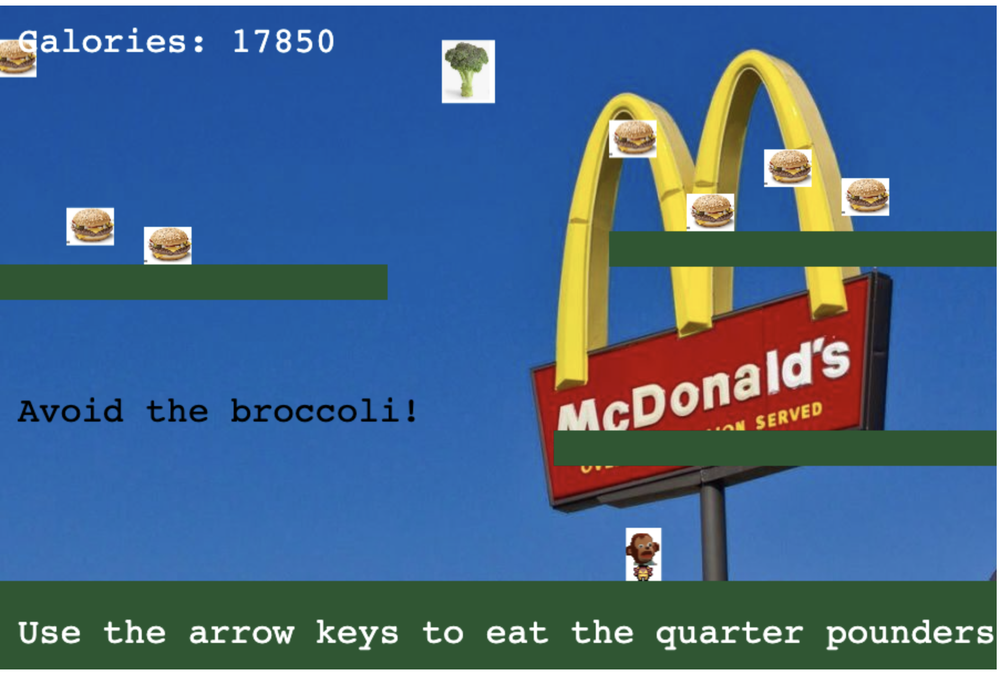

# Phaser Game

This is a janky game I made to test out the [Phaser](https://phaser.io/) framework. It is a simple reworking of the `Making Your First Phaser Game` tutorial from 2021. 

The goal of the game is to jump around and eat McDonald's quarter pounders. Collect as many calories as you can while avoiding the broccoli! If you catch the broccoli, the game is over. 

[Play here](https://rhondakremer.github.io/phaser-test/)

The game doesn't work on mobile, so don't even try!

